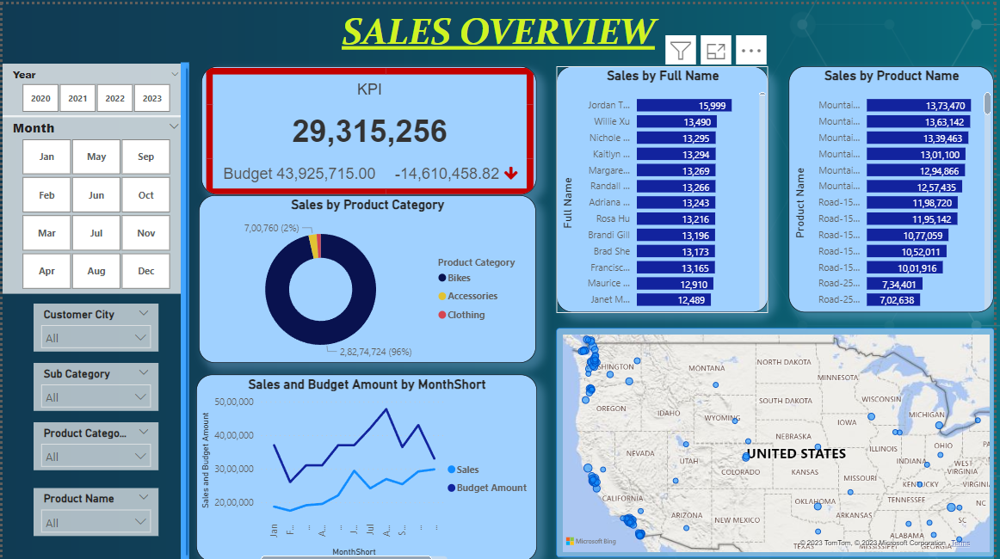
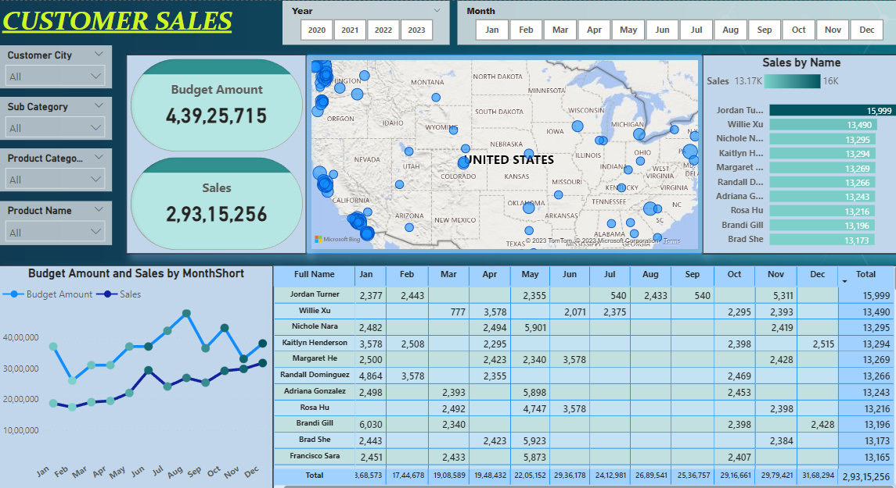
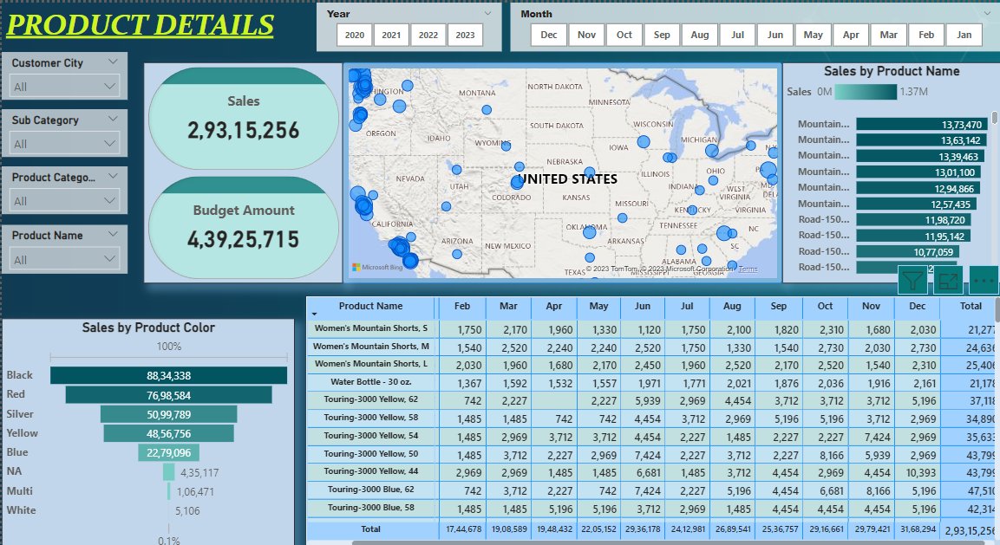

# Adventure Works Sales Report

---
## SQL QUERIES FOR THIS PROJECT
Click the link below to check the **SQL QUERIES** to transform the tables and choose selected columns for creating a Power BI dashboard.
https://github.com/Heysen3101/AdventureSalesPro/blob/main/sales.sql

## INTRODUCTION
I have created a dashboard analyzing the Adventure work sales data. I have perfomed some **sql queries** to update the data with the latest data and created 4 main tables of customer details, product details, calendar details and the sales details. I extracted this data into **Power BI** in the form of CSV Files and performed a few transformations using **Power Query**.

**_Disclaimer_:** _The Dataset used for this report is used from the database from microsoft sample datasets.._

## PROBLEM STATEMENT
1) Sales Trends: Understand how sales have changed over time.
2) Customer Analysis: Look at customer demographics and buying patterns.
3) Product Analysis: Understand which products are bestsellers, underperforming, etc.
4) Calendar Analysis: Examine seasonal trends and key dates that affect sales.

## DASHBOARD 1

## DASHBOARD 2

## DASHBOARD 3

## INSIGHTS
**DASHBOARD 1-** In this particular dashboard we can see the overview of the sales mainly focusing on the product and customer tables. We have KPI which indicate the overall Budget Amount and the sales for a particular year. From the Donut chart we analyze that bikes are the most sold. 

**DASHBOARD 2-** From the customer dashboard we are able to analyze the customers who buy the most products and where are the customers located the most through the map. We can see that the most products are sold in the west region and mininmal sales in center of united states. Through the table we can categorize their spending for each month which allows us to analyze how frequently they buy our products.

**DASHBOARD 3-** Similarly In the product dashboard we can see the most sold products and how much sales they contribute per month. Through this we can stop producing products which are less performing and are not able to provide benefits to our company. Also, from the funnel table we analyze the sales by color and in the coming years we can produce more products as per the customers liking.

## REFERENCE
DATASET USED FOR THE PROJECT --> https://drive.google.com/drive/u/0/folders/1q2g5nhaoOoAyHTybX0g5_ZDPsvJOK0EN

